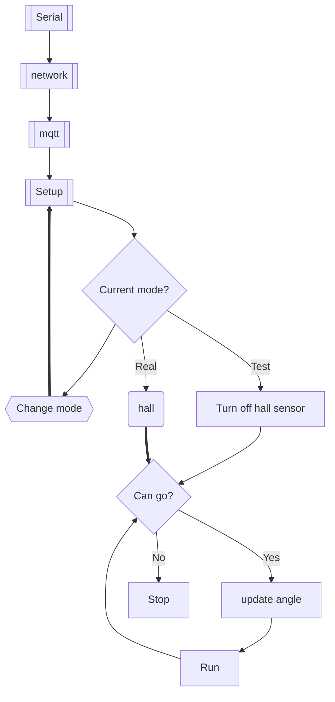

# Robotraffic car

## Hall sensor

| hall | arduino |
| ---- | ------- |
| GND  | GND     |
| +    | 5V      |
| D0   | 2       |

## L298n

| driver | arduino |
| ------ | ------- |
| PWMA   | 5       |
| AIN1   | 6       |
| AIN2   | 7       |

## QTRSensor 5RC

| line | arduino |
| ---- | ------- |
| 1    | 8       |
| 2    | 9       |
| 3    | 10      |
| 4    | 11      |
| 5    | 12      |
| En   | 13      |

## Servo

| servo  | arduino |
| ------ | ------- |
| signal | 3       |

## All topic

- input
  - parameter: update_data
    - all: get_all
  - control
    - hall: setup
    - motor: setup
    - line: setup
    - steering: setup
    - all: setup all
    - car: change mode (test mode / real mode)
- output
  - parameter
    - PID
      - input: double
      - output: double
  - state: sensors state

## Control flow

